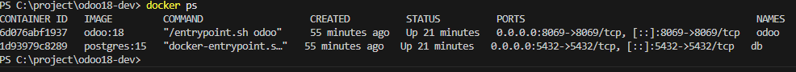
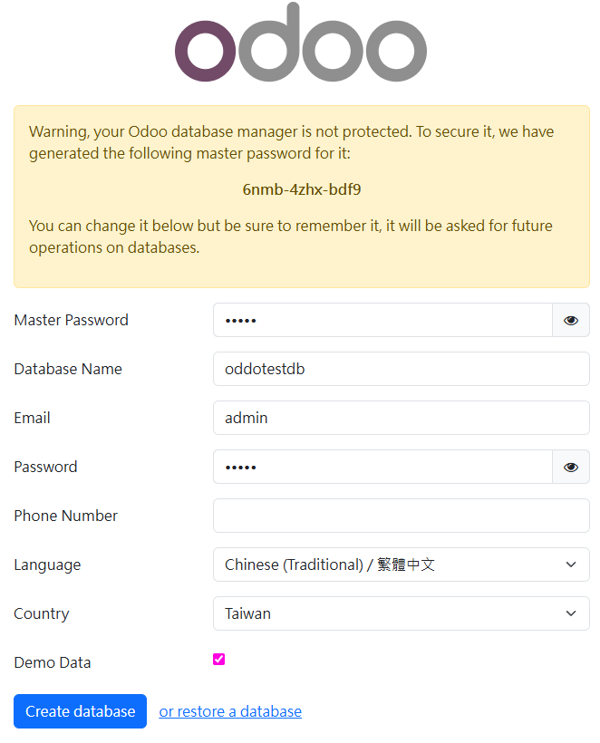
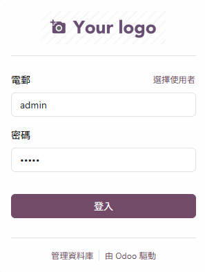
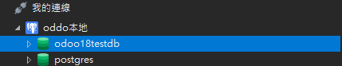
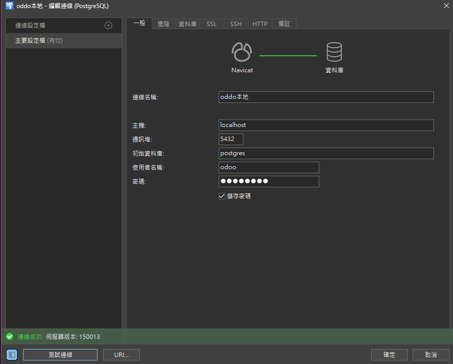
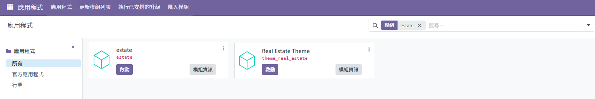
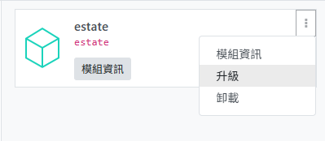

# 📦 Odoo 18 開發環境專案

本專案為一個基於 **Odoo 18** 的開發環境，支援模組擴充與 Docker 容器化部署，適合用於學習與開發企業應用系統。

---

## 📁 專案結構

| 路徑 / 檔案          | 說明                          |
| -------------------- | ----------------------------- |
| `.gitignore`         | 指定 Git 應忽略的檔案與資料夾 |
| `odoo.conf`          | Odoo 設定檔，含 DB 與服務參數 |
| `docker-compose.yml` | Docker 容器設定與服務定義     |
| `addons/`            | 自訂開發的模組存放資料夾      |
| `odoo/`              | Odoo 官方原始碼（請自行下載） |

---

## 🚀 安裝步驟

1. **克隆專案**

```bash
   git clone https://github.com/s6091214/odoo18-dev.git
   cd odoo18-dev
   ```

**下載 Odoo 原始碼**  

   ✅ 方法一：手動下載原始碼  
   從 [Odoo GitHub](https://github.com/odoo/odoo) 下載對應版本並放入 `odoo/` 資料夾中。  
   例如：

```bash
       git clone --branch 18.0 https://github.com/odoo/odoo.git ./odoo
   ```

   🔄 方法二：從已安裝容器中複製出原始碼  
   如果你使用的是 Odoo 官方映像（如 odoo:18），Odoo 原始碼其實已經內建在容器中了，你可以用以下方式複製出來（適用於研究或除錯）：

   ```bash
   # 啟動容器（如果還沒啟動）
   docker-compose up -d
   # 先建立本地 odoo 資料夾（如果還沒建立）
   mkdir -p ./odoo
   # 從容器內複製原始碼到本地 ./odoo/
   docker cp odoo:/usr/lib/python3/dist-packages/odoo ./odoo
   ```

   > 注意：`odoo` 是你的 Odoo 容器名稱，請用 `docker ps` 確認。
   

### 啟動容器

```bash
   docker-compose up -d
   ```

🌐 開啟 Odoo

1. 啟動容器後，打開瀏覽器並輸入：
👉 <http://localhost:8069>

1. 首次進入會看到建立資料庫的畫面：  



- **Email / Password**：登入 Odoo 的帳號密碼，例如 `admin / admin`
- **Database Name**：此專案的資料庫名稱，例如 `odoo_db`
- **Demo data（假資料）**：可勾選建立預設範例資料（建議測試環境使用）
  
1. 建立資料庫後會進入登入畫面，輸入剛剛設定的帳號密碼登入  


1. 開啟 Navicat 檢查是否成功建立資料庫：  
   

- 若有看到你剛剛設定的資料庫名稱（如 `odoo_db`），表示建立成功  
- 若沒有，請回頭確認容器是否有成功啟動，登入資訊是否正確，並檢查 `docker-compose.yml` 與 `odoo.conf` 中的設定是否正確。

---

## 連線資料庫

1. 打開 Navicat，新增一個 **PostgreSQL 連線**
2. 填入以下連線資訊（需對應你的 `docker-compose.yml` 設定）：
   - 連線名稱:`odootest`(自己命名)
   - 主機：`localhost`
   - 連接埠：`5432`
   - 使用者名稱：`odoo`
   - 密碼：`odoo`
   - 資料庫名稱：你在 Odoo 建立資料庫時輸入的名稱（例如 `odoo_db`）

3. 測試連線，成功後即可檢視資料表；若失敗，請檢查：
   - Docker 容器是否啟動成功
   - `docker-compose.yml` 中的 `POSTGRES_USER`, `POSTGRES_PASSWORD` 是否一致
   
4. 連線成功後
  

## 🛠️ 常用指令說明

```bash
# 啟動專案（後台運行）
docker-compose up -d
# 啟動所有 docker-compose 定義的服務，-d 表示後台運行。

# 停止專案（並移除容器、網路等）
docker-compose down
# 停止並刪除所有服務容器與相關資源。

# 查看 Odoo 服務的即時日誌
docker-compose logs -f odoo
# -f 代表持續追蹤日誌輸出。

# 查看目前運行中的所有容器
docker ps
# 列出所有正在運行的容器及相關資訊。

# 重啟指定服務容器（這裡是 odoo 服務）
docker-compose restart odoo
# 快速重啟指定服務，適合應用設定變更後使用。

# 重啟全部服務容器
docker-compose restart


# 刪除指定容器（停止後可刪除）
docker rm odoo db
# 刪除名稱為 odoo 與 db 的容器，若容器還在運行，請先停止它。

# 查看所有 Docker 卷（Volume）清單
docker volume ls
# 卷是用來持久化資料的存儲，這指令列出所有存在的卷。

# 刪除指定名稱的 Docker 卷（請將 volume_name 換成實際卷名）
docker volume rm volume_name
# 刪除指定的卷。若卷被容器使用中，需先停止並刪除相關容器。
```

---

## 🧩 新增自訂模組教學

### 1️⃣ 建立模組資料夾

在 `addons/` 底下建立你的模組資料夾，例如 `my_custom_module/`，資料夾結構如下：

```
my_custom_module/
├── __init__.py
├── __manifest__.py
├── models/
│   ├── __init__.py
│   └── my_model.py
├── views/
│   └── my_model_views.xml
```

### 2️⃣ 撰寫模組內容

#### `__manifest__.py`

```python
{
    'name': 'My Custom Module',  # 模組名稱，會顯示在 Odoo 應用程式列表中
    'version': '1.0',            # 模組版本號，建議使用語意化版本（如 1.0.0）
    'summary': '一個簡單的自訂模組',  # 簡短描述
    'author': 'Your Name',       # 開發者或公司名稱

    'depends': ['base'],         # 依賴模組列表，必須先安裝

    'data': [                   # 載入的 XML 或 CSV 檔案
        'views/my_model_views.xml',
    ],

    'installable': True,         # 是否可安裝
    'application': True,         # 是否作為獨立應用顯示
}
```

#### `models/my_model.py`

```python
from odoo import models, fields

class MyModel(models.Model):
    _name = 'my.model'
    _description = 'My Custom Model'

    name = fields.Char(string='名稱')
    active = fields.Boolean(string='啟用', default=True)
```

#### `views/my_model_views.xml`

```xml
<odoo>
    <record id="view_my_model_form" model="ir.ui.view">
        <field name="name">my.model.form</field>
        <field name="model">my.model</field>
        <field name="arch" type="xml">
            <form string="My Model">
                <sheet>
                    <group>
                        <field name="name"/>
                        <field name="active"/>
                    </group>
                </sheet>
            </form>
        </field>
    </record>

    <record id="view_my_model_tree" model="ir.ui.view">
        <field name="name">my.model.tree</field>
        <field name="model">my.model</field>
        <field name="arch" type="xml">
            <tree string="My Model">
                <field name="name"/>
                <field name="active"/>
            </tree>
        </field>
    </record>

    <menuitem id="my_model_root_menu" name="My Module"/>
    <menuitem id="my_model_menu" name="My Models" parent="my_model_root_menu"/>
    <act_window id="action_my_model"
                name="My Models"
                res_model="my.model"
                view_mode="tree,form"
                menu_id="my_model_menu"/>
</odoo>
```

### 3️⃣ 設定 addons_path（若尚未設定）

編輯 `odoo.conf`，確保有自訂模組路徑：

```ini
addons_path = /odoo/addons,/addons
```

### 4️⃣ 安裝模組

1. 重啟服務：`docker-compose restart`
2. 進入「應用程式」頁面，搜尋你的模組並安裝


---

### 5️⃣ 修改後升級模組

若修改 models 或欄位結構，請透過下列方式升級模組：

#### 頁面操作

- 到「應用程式」→「已安裝模組」，找到你的模組並點「升級」


> **注意**  
> 頁面升級方便快速，適合小改動和測試，但有時修改底層 Python 程式碼時會失敗或不完全。

#### 命令列升級（較推薦）

```bash
docker-compose exec odoo odoo -u my_custom_module -d odoo_db
```

> 這種方式更可控且完整，適合正式開發與批量部署。

---

## 📚 延伸閱讀

- [Odoo 官方開發者文件](https://www.odoo.com/documentation/18.0/developer.html)
- [Odoo 官方模組商店](https://apps.odoo.com/apps?price=Free)
- [OCA（開源社群協會）](https://odoo-community.org/shop)

---
