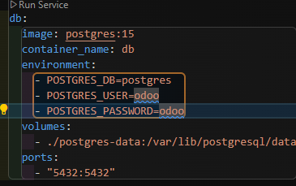

# 📦 Odoo 18 開發環境專案 {#top}

本專案為一個基於 **Odoo 18** 的開發環境，支援模組擴充與 Docker 容器化部署，適合用於學習與開發企業應用系統。

---

## 📁 專案結構

| 路徑 / 檔案          | 說明                          |
| -------------------- | ----------------------------- |
| `.gitignore`         | 指定 Git 應忽略的檔案與資料夾 |
| `odoo.conf`          | Odoo 設定檔，含 DB 與服務參數 |
| `docker-compose.yml` | Docker 容器設定與服務定義     |
| `addons/`            | 自訂開發的模組存放資料夾      |
| `odoo/`              | Odoo 官方原始碼（請自行下載） |

---

> 🔗 快速導覽：

- [環境需求與準備](#環境需求與準備)
- [安裝步驟](#安裝步驟)
- [啟動容器](#啟動容器)
- [連線資料庫](#連線資料庫)
- [docker常用指令](#docker常用指令)
- [新增自訂模組](#新增自訂模組)
- [設定 addons_path](#設定-addons_path)
- [安裝模組](#安裝模組)
- [設定權限](#設定權限)
- [修改後升級模組](#修改後升級模組)
- [消除警告](#消除警告)
- [Odoo ORM 常用欄位型別與參數對照表](#odoo-orm-常用欄位型別與參數對照表)
- [自訂表格欄位](#自訂表格欄位)
- [自訂表單](#自訂表單)
- [自訂義樣式區塊](#自訂義樣式區塊)
- [Bootstrap 常用樣式](#bootstrap-常用樣式)
- [自訂搜尋](#自訂搜尋)
- [模型之間的關聯關係](#模型之間的關聯關係)

---

### 環境需求與準備

📥 必要軟體安裝

### Docker Desktop

- 下載位置: <https://www.docker.com/products/docker-desktop>
- Windows 用戶: 需要啟用 WSL2
- 安裝後確認: 開啟 Docker Desktop，確保服務正在執行

```bash
# 測試 Docker 是否安裝成功
docker --version
docker-compose --verion
```

### Git（用於下載專案）

- 下載位置: <https://git-scm.com/downloads>
- 測試安裝:

```bash
git --version
```

### 程式碼編輯器（建議）

- 推薦: VS Code: <https://code.visualstudio.com/>

- 建議擴充套件:
  - Python <https://marketplace.visualstudio.com/items?itemName=ms-python.python>
  - XML <https://marketplace.visualstudio.com/items?itemName=redhat.vscode-xml>
  - Rainbow CSV <https://marketplace.visualstudio.com/items?itemName=mechatroner.rainbow-csv>

### 資料庫管理工具（選用）

- Navicat: <https://www.navicat.com/cht>
- pgAdmin: <https://www.pgadmin.org/>

### 安裝前檢查清單

- Docker Desktop 已安裝並啟動
- Git 已安裝並可在命令列使用
- 至少有 5GB 可用硬碟空間
- 連接埠 8069 和 5432 沒有被其他程式佔

 確認連接埠是否可用:

 ```bash
 # Windows
netstat -an | findstr :8069
netstat -an | findstr :5432

# macOS/Linux
lsof -i :8069
lsof -i :5432
```

如果有輸出結果，表示連接埠被佔用，需要先關閉佔用的程式。

[回到頂部](#top)

---

### 🚀安裝步驟

1. **克隆專案**

```bash
git clone https://github.com/s6091214/odoo18-dev.git
cd odoo18-dev
```

**下載 Odoo 原始碼**  

✅ 方法一：手動下載原始碼  
從 [Odoo GitHub](https://github.com/odoo/odoo) 下載對應版本並放入 `odoo/` 資料夾中。  
例如：

```bash
       git clone --branch 18.0 https://github.com/odoo/odoo.git ./odoo
```

  🔄 方法二：從容器中複製出原始碼  
  如果你使用的是 Odoo 官方映像（如 `odoo:18`），Odoo 原始碼其實已經內建在容器中了，你可以用以下方式複製出來（適用於研究或除錯）：

   ```bash
   # 啟動容器（如果還沒啟動）
   docker-compose up -d
   # 先建立本地 odoo 資料夾（如果還沒建立）
   mkdir -p ./odoo
   # 從容器內複製原始碼到本地 ./odoo/
   docker cp odoo:/usr/lib/python3/dist-packages/odoo ./odoo
   ```

   > 注意：`odoo` 是你的 Odoo 容器名稱，請用 `docker ps` 確認。
   

   [回到頂部](#top)

### 啟動容器

```bash
   docker-compose up -d
   ```

🌐 開啟 Odoo

1. 啟動容器後，打開瀏覽器並輸入：
👉 <http://localhost:8069>

1. 首次進入會看到建立資料庫的畫面：  


- **Email / Password**：登入 Odoo 的帳號密碼，例如 `admin / admin`
- **Database Name**：此專案的資料庫名稱，例如 `odoo_db`
- **Demo data（假資料）**：可勾選建立預設範例資料（建議測試環境使用）
  
1. 建立資料庫後會進入登入畫面，輸入剛剛設定的帳號密碼登入  


1. 開啟 Navicat 檢查是否成功建立資料庫：  
   

- 若有看到你剛剛設定的資料庫名稱（如 `odoo_db`），表示建立成功  
- 若沒有，請回頭確認容器是否有成功啟動，登入資訊是否正確，並檢查 `docker-compose.yml` 與 `odoo.conf` 中的設定是否正確。

[回到頂部](#top)

---

## 連線資料庫

1. 打開 Navicat，新增一個 **PostgreSQL 連線**
2. 填入以下連線資訊（需對應你的 `docker-compose.yml` 設定）：
   - 連線名稱:`odootest`(自己命名)
   - 主機：`localhost`
   - 連接埠：`5432`
   - 使用者名稱：`odoo`
   - 密碼：`odoo`
   - 資料庫名稱：你在 Odoo 建立資料庫時輸入的名稱（例如 `odoo_db`）

3. 測試連線，成功後即可檢視資料表；若失敗，請檢查：
   - Docker 容器是否啟動成功
   - `docker-compose.yml` 中的 `POSTGRES_USER`, `POSTGRES_PASSWORD` 是否一致
   
4. 連線成功後
  

  [回到頂部](#top)

### docker常用指令

```bash
# 啟動專案（後台運行）
docker-compose up -d
# 啟動所有 docker-compose 定義的服務，-d 表示後台運行。

# 停止專案（並移除容器、網路等）
docker-compose down
# 停止並刪除所有服務容器與相關資源。

# 查看 Odoo 服務的即時日誌
docker-compose logs -f odoo
# -f 代表持續追蹤日誌輸出。

# 查看目前運行中的所有容器
docker ps
# 列出所有正在運行的容器及相關資訊。

# 重啟指定服務容器（這裡是 odoo 服務）
docker-compose restart odoo
# 快速重啟指定服務，適合應用設定變更後使用。

# 重啟全部服務容器
docker-compose restart


# 刪除指定容器（停止後可刪除）
docker rm odoo db
# 刪除名稱為 odoo 與 db 的容器，若容器還在運行，請先停止它。

# 查看所有 Docker 卷（Volume）清單
docker volume ls
# 卷是用來持久化資料的存儲，這指令列出所有存在的卷。

# 刪除指定名稱的 Docker 卷（請將 volume_name 換成實際卷名）
docker volume rm volume_name
# 刪除指定的卷。若卷被容器使用中，需先停止並刪除相關容器。
```

[回到頂部](#top)

---

### 新增自訂模組

### 1️⃣ 建立模組資料夾

在 `addons/` 底下建立你的模組資料夾，例如 `my_custom_module/`，資料夾結構如下：

```bash
my_custom_module/
├── __init__.py
├── __manifest__.py
├── models/
│   ├── __init__.py
│   └── my_model.py
├── views/
│   └── my_model_views.xml
```

### 2️⃣ 撰寫模組內容

#### `__manifest__.py`

```python
{
    'name': 'My Custom Module',  # 模組名稱，會顯示在 Odoo 應用程式列表中
    'version': '1.0',            # 模組版本號，建議使用語意化版本（如 1.0.0）
    'summary': '一個簡單的自訂模組',  # 簡短描述
    'author': 'Your Name',       # 開發者或公司名稱

    'depends': ['base'],         # 依賴模組列表，必須先安裝

    'data': [                   # 載入的 XML 或 CSV 檔案
        'views/my_model_views.xml',
    ],

    'installable': True,         # 是否可安裝
    'application': True,         # 是否作為獨立應用顯示
}
```

#### `models/my_model.py`

```python
from odoo import models, fields

class MyModel(models.Model):
    _name = 'my.model'
    _description = 'My Custom Model'

    name = fields.Char(string='名稱')
    active = fields.Boolean(string='啟用', default=True)
```

#### `views/my_model_views.xml`

```xml
<odoo>
    <!-- 定義一個動作（Action）讓使用者能透過 UI 開啟 model 的視圖 -->
    <record id="test_model_action" model="ir.actions.act_window">
        <!-- 在後台或選單中顯示的動作名稱 -->
        <field name="name">Test action</field>

        <!-- 綁定的模型（這裡是你在 models 定義的 test_model） -->
        <field name="res_model">test_model</field>

        <!-- 顯示模式，list 表示清單檢視，form 表示表單檢視 -->
        <field name="view_mode">list,form</field>
    </record>
</odoo>
```

🧩 這段 XML 的功能？
這是 建立一個後台的「操作動作 (action)」。意思是，你在 Odoo 後台可以點選某個項目，開啟對應的模型資料，進入清單或表單頁面。

🧱 各部分說明
元素 說明

| 元素                              | 說明                                  |
| ------------------------------- | ----------------------------------- |
| `<record ...>`                  | 用來建立資料（在這裡是 Action 設定）              |
| `id="test_model_action"`        | 這個是這段設定的唯一識別 ID，可在其他地方引用            |
| `model="ir.actions.act_window"` | 告訴 Odoo 這是一個「開窗動作」                  |
| `<field name="name">`           | 顯示在選單或視圖上的名稱                        |
| `<field name="res_model">`      | 綁定你想要打開的模型（你在 Python 中定義的）          |
| `<field name="view_mode">`      | 顯示的方式，`list` 表示清單、`form` 表示表單，可兩者都寫 |

#### python 檔案（models/test_model.py）

```python
from odoo import models, fields

class TestModel(models.Model):
    _name = "test.model"
    _description = "測試模型"

    name = fields.Char(string="名稱")
    description = fields.Text(string="說明")
```

注意：這裡的 _name = "test.model" 要和 XML 中的 `<field name="res_model">`test.model</field> 一致。
res_model 一定要完全等於你在 Python 裡定義的 _name 字串，否則會報錯「無效的模型名稱」。


當你修改或新增 XML 檔案，例如 estate/views/estate_property_views.xml，可以從 Docker log中觀察是否成功載入：

```bash
INFO odoo18testdb odoo.modules.loading: loading estate/views/estate_property_views.xml 
```

這行訊息代表你的 XML 檔案已成功被 Odoo 載入。

❗ 若升級或安裝失敗

```bash
odoo.tools.convert.ParseError: while parsing /mnt/extra-addons/estate/views/estate_property_views.xml:2
動作定義中使用了無效的模型名稱「estate_property」。
```


💥 代表 res_model="estate_property" 找不到模型，請檢查以下：

- 你在 estate_property.py 中定義的_name 是否與 XML 裡的 `<field name="res_model">` 內容一致
✅ 正確的例子：
Python 中 _name = "estate.property"，那麼 XML 裡要寫：
`<field name="res_model">`estate.property</field>

- 注意不要混用底線和點號：
_name = "estate.property" ⛔ 不能寫成 res_model="estate_property"，這樣會找不到模型。

#### 加上 Menu 選單（可選）

如果你希望這個畫面能從左側選單開啟，還要加這個：

```xml
<odoo>
    <menuitem id="test_menu_root" name="房地產廣告測試">
        <menuitem id="test_first_level_menu" name="房屋訊息測試">
            <menuitem id="test_model_menu_action" action="estate_property_action" />
        </menuitem>
    </menuitem>
</odoo>

```

🔸 第一層：根選單（test_menu_root）

```xml
<menuitem id="test_menu_root" name="房地產廣告測試">
```

- name="房地產廣告測試"：這是畫面上顯示的名稱，在左上角選單中打開。
- 安裝或升級模組成功後顯示畫面:


🔸 第二層：子選單（test_first_level_menu）

```xml
<menuitem id="test_first_level_menu" name="房屋訊息測試">
```

- 使用者在第一層點選後會看到這個項目。


🔸 第三層：點選會開啟頁面的選單（test_model_menu_action）

```xml
<menuitem id="test_first_level_menu" name="房屋訊息測試">
```

- action="estate_property_action"：這代表使用者點這個選單時，要打開哪一個畫面。
- estate_property_action 是你在另外一份 XML 中定義的畫面開啟方式（比如清單＋表單檢視）

🧠 小提醒

- 所有 id 都不能重複。
- action 要先定義（在另一個 XML 裡），然後在這裡被引用。
- 所有這些 XML 最後都會放進 **manifest**.py 的 data 欄位中有引入先後順序要注意：

```python
'data': [
    'views/estate_property_views.xml',
    'views/estate_menus.xml',
],
```

[回到頂部](#top)

---

### 設定 addons_path

編輯 `odoo.conf`，確保有自訂模組路徑：

```ini
addons_path = /odoo/addons,/addons
```

[回到頂部](#top)

---

### 安裝模組

1. 重啟服務：`docker-compose restart`
2. 進入「應用程式」頁面，搜尋你的模組並安裝

3. 搜尋你的模組
若你的模組 **manifest**.py 中有設定 "application": True，則會出現在應用程式列表中，可直接搜尋模組名稱。

4. 若搜尋不到模組？請檢查以下事項：
   - ✅ 是否已在 **manifest**.py 中加上 "application": True
   - 有的話模組會顯示在應用程式頁面中
   - 沒有的話，模組預設會被隱藏，不會出現在應用程式清單中
   - 取消搜尋框中的「應用程式」，再輸入模組名稱搜尋

[回到頂部](#top)

---

### 設定權限

當你建立自訂模型後，必須定義存取權限，否則在容器內查看log會看到警告。
📁 建立權限設定檔
在模組的新增security資料夾並在裡面建立一個檔案：
📄 ir.model.access.csv


✍️ 範例內容（只有讀取權限）

```cs
id,name,model_id:id,group_id:id,perm_read,perm_write,perm_create,perm_unlink
access_estate_property,access.estate.property,model_estate_property,base.group_user,1,0,0,0
```

🔁 若要給全部權限（開發階段建議用）

```cs
id,name,model_id:id,group_id:id,perm_read,perm_write,perm_create,perm_unlink
access_estate_property_all,access.estate.property.all,model_estate_property,base.group_user,1,1,1,1
```

🧩 確保載入權限檔案
在你的 **manifest**.py 中加入權限檔案到 data 欄位：

```python
'data': [
    'security/ir.model.access.csv',
    'views/my_model_views.xml',
],
```

[回到頂部](#top)

---

### 修改後升級模組

若修改 models 或欄位結構，請透過下列方式升級模組：

#### 頁面操作

- 重啟服務：`docker-compose restart`
- 搜尋你的模組並點「升級」

- 查看資料庫欄位有沒有新增成功

> **注意**  
> 頁面升級方便快速，適合小改動和測試，但有時修改底層 Python 程式碼時會失敗或不完全。

#### 模組升級（較推薦）

```bash
docker-compose exec web odoo -u 模組名稱 -d 資料庫名稱 --no-http
docker-compose exec web odoo -u estate -d odoo18testdb --no-http
```

> 這種方式更可控且完整，適合正式開發與批量部署。

[回到頂部](#top)

---

### 消除警告

⚠️ 1. 缺少 license 欄位警告

```bash
WARNING odoo18testdb odoo.modules.module: Missing `license` key in manifest for 'estate', defaulting to LGPL-3
```

這是因為你在 estate 模組的 **manifest**.py 中 沒有指定 license 授權條款。雖然 Odoo 預設會使用 LGPL-3，但仍會顯示警告。

✅ 解決方式如下

在 **manifest**.py 補上：

```python
'license': 'LGPL-3',
```

ℹ️ 若你不補上這個欄位，Odoo 仍會自動套用 LGPL-3，不影響功能，但會顯示警告。

⚠️ 2. 模型缺少權限設定警告

```bash
WARNING odoo18testdb odoo.modules.loading: The models ['estate.property'] have no access rules in module estate, consider adding some, like:

id,name,model_id:id,group_id:id,perm_read,perm_write,perm_create,perm_unlink
```

說明：

這是提醒你尚未為模型（例如 estate.property）定義存取權限，沒有設定的話，非超級管理員無法操作該模型資料。

✅ 解決方式：
請參考 👉 5️⃣[設定權限](#5️⃣-設定權限) 並在你的模組中新增 security/ir.model.access.csv 檔案。
⚠️ 若未新增，模組仍可安裝，但非管理員帳號將無法操作任何 estate.property 的記錄。

[回到頂部](#top)

---

### Odoo ORM 常用欄位型別與參數對照表

✅ 1. 字串欄位（文字）

```python
name = fields.Char(string="名稱", required=True, help="輸入名稱", default="預設值")
```

| 參數名稱       | 說明               |
| ---------- | ---------------- |
| `string`   | 欄位標籤（畫面顯示用）      |
| `required` | 是否必填（True/False） |
| `default`  | 預設值              |
| `help`     | 顯示說明（滑鼠提示）       |

✅ 2. 數字欄位（整數 / 浮點數）

```python
age = fields.Integer(string="年齡", required=False)
price = fields.Float(string="價格", digits=(6, 2))
```

| 型別        | 說明      |
| --------- | ------- |
| `Integer` | 整數      |
| `Float`   | 浮點數，小數點 |

🧠 digits=(6, 2) 表示：最多6位數，其中2位小數

✅ 3. 布林欄位（True/False）

```python
active = fields.Boolean(string="啟用", default=True)
```

✅ 通常搭配 active 欄位，控制資料是否顯示於清單中

✅ 4. 日期欄位

```python
start_date = fields.Date(string="開始日期")
end_time = fields.Datetime(string="結束時間")
```

| 型別         | 說明                           |
| ---------- | ---------------------------- |
| `Date`     | 只有日期（yyyy-mm-dd）             |
| `Datetime` | 日期+時間（yyyy-mm-dd hh\:mm\:ss） |

✅ 5. 關聯欄位（Many2one、One2many、Many2many）

```python
# 單筆關聯
partner_id = fields.Many2one('res.partner', string="客戶")

# 一對多
order_lines = fields.One2many('sale.order.line', 'order_id', string="訂單明細")

# 多對多
tags = fields.Many2many('res.partner.category', string="分類標籤")
```

| 型別          | 說明           |
| ----------- | ------------ |
| `Many2one`  | 對應一筆資料（下拉選單） |
| `One2many`  | 關聯多筆資料（子表格）  |
| `Many2many` | 多對多關係（多選）    |

✅ 常見參數速查表

| 參數         | 用法範例            | 說明            |
| ---------- | --------------- | ------------- |
| `string`   | `string="名稱"`   | 畫面上顯示的欄位名稱    |
| `required` | `required=True` | 是否為必填欄位       |
| `default`  | `default="預設值"` | 指定預設值         |
| `help`     | `help="滑鼠提示說明"` | 滑鼠移過時的說明提示    |
| `readonly` | `readonly=True` | 僅讀欄位，不能編輯     |
| `index`    | `index=True`    | 加索引，加速搜尋（技術用） |
| `copy`     | `copy=False`    | 複製紀錄時是否也複製這欄位 |
| `tracking` | `tracking=True` | 是否開啟追蹤（記錄修改）  |

[回到頂部](#top)

---

### 自訂表格欄位

範例

```xml
<record id="view_model_list" model="ir.ui.view">
  <field name="name">model.list</field>
  <field name="model">your.model.name</field>
  <field name="arch" type="xml">
    <list>
      <field name="field1" string="自訂欄位1名稱"/>
      <field name="field2" string="自訂欄位2名稱"/>
    </list>
  </field>
</record>
```

[回到頂部](#top)

---

### 自訂表單

基本結構說明

```xml
<record id="view_estate_property_form" model="ir.ui.view">
  <field name="name">view_estate_property_form</field>
  <field name="model">estate_property</field>

  <!-- 表單畫面的 XML 架構 -->
  <field name="arch" type="xml">
    <form string="房產表單">
      <sheet>
        <!-- 表單標題 -->
        <h1>
          <field name="name"/>
        </h1>

        <!-- 一般欄位區域 -->
        <group>
          <field name="expected_price"/>
          <field name="selling_price"/>
          <field name="state"/>
          <field name="active"/>
        </group>

        <!-- 分頁顯示區 -->
        <notebook>
          <page string="詳細資訊">
            <field name="description"/>
          </page>
        </notebook>

      </sheet>
    </form>
  </field>
</record>
```

🧠 標籤說明

| 元素             | 說明                        |
| -------------- | ------------------------- |
| `<form>`       | 表示這是「表單視圖」，顯示一筆資料的詳細內容    |
| `<sheet>`      | Odoo 標準的版型區塊，內部放欄位與頁籤等    |
| `<h1>`         | 放在頂部，通常用來顯示名稱或標題欄位        |
| `<group>`      | 會將欄位左右分欄顯示，排版整齊           |
| `<notebook>`   | 分頁元件，讓表單分成不同頁籤（例如基本資訊、備註） |
| `<page>`       | notebook 裡的每一個分頁          |
| `string="..."` | 自訂每個區塊的標題（例如表單名稱或頁籤標題）    |

[回到頂部](#top)

---

### 自訂搜尋

🧩 1. 定義搜尋視圖（search view）
在你的自訂模組中的 XML 檔案中，繼承目標模型的 search view，並新增自訂篩選器：

```xml
    <record id="estate_property_views_search" model="ir.ui.view">
        <field name="name">estate_property_views_form_search</field>
        <field name="model">estate_property</field>
        <field name="arch" type="xml">
            <search>
                <field name="name" />
                <field name="postcode" />
                <field name="expected_price" />
                <field name="bedrooms" />
                <field name="living_area" />
                <field name="facades" />

                <filter string="可用的" name="available"
                    domain="['|', ('state', '=', 'new'), ('state', '=', 'offer_received')]" />
                <group expand="1" string="Group By">
                    <filter string="郵政編碼" name="postcode"
                        context="{'group_by':'postcode', 'residual_visible':True}" />
                </group>
            </search>

        </field>
    </record>
```

🔎 `<search>` 區塊：搜尋欄位定義

```xml
<search>
  <field name="name" />
  <field name="postcode" />
  ...
</search>
```

- field：列出可以搜尋的欄位，會顯示在搜尋列中。
- 這些欄位對應模型中的欄位，例如房產名稱、郵遞區號、預期售價、房間數等。

✅ `<filter>` 自訂篩選器

```xml
<filter string="可用的" name="available"
    domain="['|', ('state', '=', 'new'), ('state', '=', 'offer_received')]" />
```

- string：顯示名稱。
- name：內部識別名稱。
- domain：篩選條件。

`<group>` 群組篩選器

```xml
<group expand="1" string="Group By">
  <filter string="郵政編碼" name="postcode"
      context="{'group_by':'postcode', 'residual_visible':True}" />
</group>
```

📝 小提醒

- 自訂篩選器的 domain 必須是合法的 domain 語法，並注意字串是否加上引號。
- 可根據實際需求，新增多個 filter 與 group_by。
- 搭配 default_ 參數可以讓某個篩選器預設啟用。

[回到頂部](#top)

---

### 自訂義樣式區塊

📁 SCSS
請放在 your_module/static/src/scss/custom_styles.scss
📁 CSS
請放在 your_module/static/src/css/custom_styles.css
📦 加入到 manifest.py

```python
"assets": {
    "web.assets_backend": [
        "your_module/static/src/scss/custom_styles.scss",  # 若用 SCSS
        # "your_module/static/src/css/custom_styles.css",  # 若用 CSS
    ],
},
```

📋 用法示例

```xml
<list>
  <field name="name" class="property-col-25 text-bold text-center bg-lightgray"/>
  <field name="expected_price" class="property-col-25 text-right text-green"/>
  <field name="selling_price" class="property-col-25 text-right text-red"/>
  <field name="date_availability" class="property-col-25 text-center"/>
</list>
```

Bootstrap 加入方式（官方已內建）
Odoo 18 後台使用 Bootstrap 5 已經內建，你無需額外引入，可直接使用 Bootstrap 的 class，例如：

```xml
<field name="expected_price" class="text-end text-success fw-bold bg-light" />
```

[回到頂部](#top)

---

### Bootstrap 常用樣式

🔗 參考文件：
👉 [Bootstrap 5 文件 - HEX School 中文版](https://bootstrap5.hexschool.com/docs/5.1/getting-started/introduction/)

## 文字對齊 {#text-align}

| Class         | 功能    | 範例用法                             |
| ------------- | ------- | ---------------------------------- |
| `text-start`  | 靠左對齊 | `<div class="text-start">...</div>` |
| `text-center` | 置中對齊 | `<div class="text-center">...</div>` |
| `text-end`    | 靠右對齊 | `<div class="text-end">...</div>`    |

---

## 文字顏色 {#text-color}

| Class            | 功能           | 範例用法                                 |
| ---------------- | -------------- | -------------------------------------- |
| `text-primary`   | 主要色文字（藍） | `<p class="text-primary">主要色文字</p>` |
| `text-secondary` | 次要色文字（灰） | `<p class="text-secondary">次要色文字</p>` |
| `text-success`   | 成功色文字（綠） | `<p class="text-success">成功色文字</p>` |
| `text-danger`    | 危險色文字（紅） | `<p class="text-danger">危險色文字</p>` |
| `text-warning`   | 警告色文字（黃） | `<p class="text-warning">警告色文字</p>` |
| `text-info`      | 資訊色文字（淺藍） | `<p class="text-info">資訊色文字</p>`    |
| `text-light`     | 淺色文字       | `<p class="text-light bg-dark">淺色文字</p>` |
| `text-dark`      | 深色文字       | `<p class="text-dark">深色文字</p>`       |
| `text-muted`     | 變灰文字       | `<p class="text-muted">變灰文字</p>`       |

---

## 按鈕 {#buttons}

| Class               | 功能        | 範例用法                                  |
| ------------------- | --------- | --------------------------------------- |
| `btn`               | 按鈕基礎樣式 | `<button class="btn btn-primary">按鈕</button>` |
| `btn-primary`       | 主要按鈕顏色 | `<button class="btn btn-primary">主要</button>`  |
| `btn-secondary`     | 次要按鈕顏色 | `<button class="btn btn-secondary">次要</button>` |
| `btn-success`       | 成功綠色按鈕 | `<button class="btn btn-success">成功</button>`  |
| `btn-danger`        | 危險紅色按鈕 | `<button class="btn btn-danger">危險</button>`   |
| `btn-warning`       | 警告黃色按鈕 | `<button class="btn btn-warning">警告</button>`  |
| `btn-info`          | 資訊淺藍按鈕 | `<button class="btn btn-info">資訊</button>`     |
| `btn-light`         | 淺色按鈕     | `<button class="btn btn-light">淺色</button>`    |
| `btn-dark`          | 深色按鈕     | `<button class="btn btn-dark">深色</button>`     |
| `btn-link`          | 連結樣式按鈕 | `<button class="btn btn-link">連結</button>`     |

---

## 邊框 {#borders}

| Class            | 功能         | 範例用法                              |
| ---------------- | ---------- | ----------------------------------- |
| `border`         | 加上邊框      | `<div class="border">有邊框的區塊</div>`  |
| `border-top`     | 上邊框       | `<div class="border-top">只有上邊框</div>` |
| `border-bottom`  | 下邊框       | `<div class="border-bottom">只有下邊框</div>`|
| `border-primary` | 藍色邊框     | `<div class="border border-primary">藍色邊框</div>` |
| `rounded`        | 圓角邊框     | `<div class="border rounded">圓角邊框</div>`  |
| `rounded-circle` | 圓形         | `<div class="rounded-circle" style="width:50px; height:50px; background:#eee;"></div>` |

---

## 間距 (Margin 和 Padding) {#spacing}

| Class             | 功能                  | 範例用法                               |
| ----------------- | --------------------- | ------------------------------------ |
| `m-0`             | 全部外距 0            | `<div class="m-0">無外距</div>`        |
| `mt-3`            | 上方外距 1rem (16px)  | `<div class="mt-3">上方外距3</div>`     |
| `mb-1`            | 下方外距 0.25rem (4px) | `<div class="mb-1">下方外距1</div>`     |
| `mx-auto`         | 左右外距自動置中      | `<div class="mx-auto" style="width:200px;">置中區塊</div>` |
| `p-2`             | 全部內距 0.5rem (8px) | `<div class="p-2">內距2</div>`          |
| `px-4`            | 左右內距 1.5rem (24px) | `<div class="px-4">左右內距4</div>`     |
| `py-0`            | 上下內距 0            | `<div class="py-0">上下內距0</div>`     |

---

## 排版 (Display) {#display}

| Class       | 功能               | 範例用法                          |
| ----------- | ------------------ | -------------------------------- |
| `d-none`    | 隱藏元素           | `<div class="d-none">隱藏</div>` |
| `d-block`   | 區塊元素           | `<div class="d-block">區塊</div>` |
| `d-inline`  | 內聯元素           | `<span class="d-inline">內聯</span>` |
| `d-inline-block` | 內聯區塊元素   | `<span class="d-inline-block">內聯區塊</span>` |
| `d-flex`    | 彈性盒子容器       | `<div class="d-flex">Flex</div>`  |
| `d-grid`    | Grid 容器          | `<div class="d-grid">Grid</div>`  |

---

## 顯示與隱藏 {#visibility}

| 類別                  | 功能說明                     | 範例用法                                                   |
| ------------------- | ------------------------ | ------------------------------------------------------ |
| `visible`           | 元素可見 | `<div class="visible">可見</div>`   |
| `invisible`         | 元素不可見但仍佔位                | `<div class="invisible">隱形但佔位</div>`                   |
| `d-none`            | 所有螢幕隱藏                   | `<div class="d-none">永遠隱藏</div>`                       |
| `d-sm-none`         | `≥576px` 隱藏，小於 576px 顯示  | `<div class="d-sm-none">小於 576px 顯示，其餘隱藏</div>`        |
| `d-none d-sm-block` | `<576px` 隱藏，`≥576px` 顯示  | `<div class="d-none d-sm-block">576px 以上顯示，以下隱藏</div>` |
| `d-md-block`        | `≥768px` 顯示為區塊元素（block）  | `<div class="d-md-block">中螢幕以上顯示</div>`                |

---

## Bootstrap 5 斷點整理對照表

| 尺寸代碼  | 像素斷點      | 用途簡介     |
| ----- | --------- | -------- |
| `xs`  | `<576px`  | 極小裝置（手機） |
| `sm`  | `≥576px`  | 小裝置（大手機） |
| `md`  | `≥768px`  | 中裝置（平板）  |
| `lg`  | `≥992px`  | 大裝置（筆電）  |
| `xl`  | `≥1200px` | 更大裝置     |
| `xxl` | `≥1400px` | 超大顯示器    |

[回到頂部](#top)

---

### 模型之間的關聯關係

在 Odoo 中，模型之間的關係（Relationships）通常透過以下三種欄位類型實現：

- `Many2one`: 多對一
- `One2many`: 一對多
- `Many2many`: 多對多

---

## 🧩 1. Many2one（多對一）

一個房屋屬於一個房屋類型。

```python
# models/estate_property.py

property_type_id = fields.Many2one(
    "estate.property.type",
    string="房屋類型",
)
```

這表示每一個 estate.property 都指向一個 estate.property.type。

---

🔁 2. One2many（一對多）

一個房屋類型可以對應到很多房屋。

```python
# models/estate_property_type.py

property_ids = fields.One2many(
    "estate.property",      # 目標模型
    "property_type_id",     # 對方的 Many2one 欄位名
    string="房屋列表",
)
```

One2many 必須搭配對方的 Many2one 使用。

🔗 3. Many2many（多對多）

一個房屋可以有多個標籤，標籤也可以套用到多個房屋。

```python
# models/estate_property.py

tag_ids = fields.Many2many(
    "estate.property.tag",
    string="標籤"
)
```

這會自動建立一張中介資料表，儲存兩邊的對應關係。

🛠 關聯欄位的常見參數

| 參數         | 說明                     |
| ---------- | ---------------------- |
| `string`   | 顯示名稱                   |
| `required` | 是否必填欄位                 |
| `ondelete` | 當關聯資料被刪除時的行為（cascade等） |
| `domain`   | 限制可選範圍                 |
| `default`  | 預設值                    |

🧪 補充：透過 XML 設定表單關聯欄位

```xml
<!-- views/estate_property_views.xml -->
<field name="property_type_id"/>
<field name="tag_ids" widget="many2many_tags"/>
```

| 關係類型 | 關鍵欄位類型      | 描述                |
| ---- | ----------- | ----------------- |
| 多對一  | `Many2one`  | 多個物件連到一個主物件       |
| 一對多  | `One2many`  | 需要與 `Many2one` 搭配 |
| 多對多  | `Many2many` | 雙方皆可有多個關聯         |

💡 小提示

- 命名時盡量使用 _id（Many2one）或_ids（One2many、Many2many）做為結尾。
- One2many 的 fields 中不能獨立使用，必須配合 Many2one。
- Many2many 可透過 relation 參數自定中介資料表名稱（通常不必自訂）。

[回到頂部](#top)

---

### 常見 widget 分類與用途

🔹 1. 文字與選項顯示

```xml
<field name="欄位名稱" widget="html"/>
```

| Widget 名稱   | 搭配欄位型別      | 說明與範例顯示         |
| ----------- | ----------- | --------------- |
| `char`（預設）  | `Char`      | 一般文字輸入框         |
| `text`      | `Text`      | 多行文字輸入欄位        |
| `html`      | `Html`      | 富文字編輯器（類似 Word） |
| `selection` | `Selection` | 下拉選單或選項         |
| `radio`     | `Selection` | 圓形單選按鈕列表        |
| `email`     | `Char`      | 顯示 email 並點擊發信  |
| `url`       | `Char`      | 顯示為超連結          |

🔹 2. Many2many 類別常用 widget

```xml
<field name="tag_ids" widget="many2many_tags"/>
```

| Widget 名稱              | 顯示方式   | 備註       |
| ---------------------- | ------ | -------- |
| `many2many_tags`       | 多個彩色標籤 | 可新增、刪除   |
| `many2many_checkboxes` | 勾選框    | 用於固定選項   |
| `many2many_binary`     | 附件清單   | 用於上傳多個附件 |

🔹 3. One2many 類別常用 widget

```xml
<field name="offer_ids" widget="one2many_list">
  <tree editable="bottom">
    <field name="partner_id"/>
    <field name="price"/>
  </tree>
</field>
```

| Widget 名稱       | 顯示方式    | 備註                               |
| --------------- | ------- | -------------------------------- |
| `one2many_list` | 表格（可新增） | 搭配 `<list editable="bottom">` 使用 |
| `one2many`（預設）  | 頁籤/嵌入表單 | 可進一步進入明細頁

🔹 4. 附件與圖像相關

```xml
<field name="image" widget="image" class="oe_avatar"/>
```

| Widget 名稱          | 用途    |
| ------------------ | ----- |
| `image`            | 顯示圖片  |
| `binary`           | 上傳檔案  |
| `many2many_binary` | 多附件列表 |

🔹 5. 布林類型與控制

| Widget 名稱        | 用途               |
| ---------------- | ---------------- |
| `boolean_toggle` | 顯示為 ON/OFF 切換    |
| 預設布林欄位           | 顯示為 Checkbox 勾選框 |

📘 小技巧：結合 options 更好用

```xml
<field name="tag_ids" widget="many2many_tags">
  <options>
    <option name="no_create" value="1"/>
    <option name="color_field" value="color"/>
  </options>
</field>
```

| 選項名稱              | 功能             |
| ----------------- | -------------- |
| `no_create`       | 不允許使用者新增項目     |
| `no_quick_create` | 關閉快速建立選項（僅可搜尋） |
| `color_field`     | 指定彩色標籤的顏色欄位    |

---

## 📚 延伸閱讀

- [Odoo 官方開發者文件](https://www.odoo.com/documentation/18.0/developer.html)
- [Odoo 官方模組商店](https://apps.odoo.com/apps?price=Free)
- [OCA（開源社群協會）](https://odoo-community.org/shop)

---
